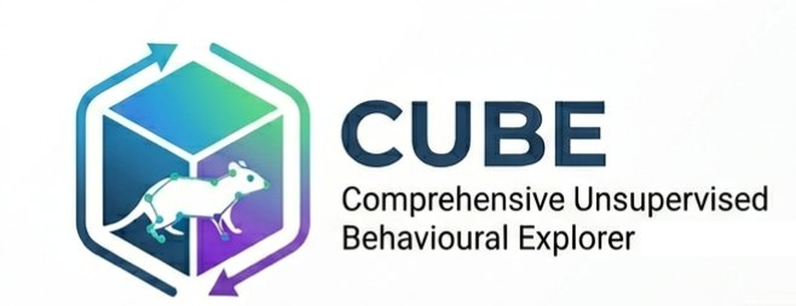

<p align="center">
  
</p>

<h1 align="center">CUBE — Comprehensive Unsupervised Behavioral Explorer</h1>

<p align="center">
  An automated, end-to-end pipeline for discovering and quantifying animal behavior from video — no manual labeling required.
</p>

---

## Overview

CUBE integrates **DeepLabCut pose estimation** with unsupervised machine learning (UMAP + HDBSCAN + MLP classifier) to automatically segment, cluster, and analyze animal behavioral patterns from raw video recordings. The full pipeline runs from raw video to statistical reports without requiring any predefined behavioral categories.

**Key features:**
- Batch DLC inference using the SuperAnimal quadruped model
- Smart Adapt mode: adapts the model once on a representative video, then reuses weights for all videos
- V2 multi-scale feature extraction with body-size normalization and angular body-axis features
- Automatic HDBSCAN cluster sweep with DBCV-guided selection
- Built-in validation layer (silhouette, UMAP trustworthiness, CV accuracy, DLC quality gates)
- Interactive video annotation and behavioral analysis with group statistics and ethograms
- Session autosave — resume after a crash from the last completed step

---

## Pipeline Steps

| Step | Module | Description |
|------|--------|-------------|
| 1 | `cube.py` | **DLC Inference** — Run DeepLabCut SuperAnimal on raw videos |
| 2 | `cube_core.py` | **Pre-processing** — Filter bodyparts, export H5/CSV |
| 3 | `cube_core.py` | **Clustering** — UMAP → HDBSCAN → MLP classifier |
| 4 | `cube_video_explorer.py` | **Video Annotation** — Label clusters via example clips |
| 5 | `cube_analyser.py` | **Behaviour Analysis** — Ethograms, statistics, group comparisons |

---

## Setting Up the Anaconda Environment

### 1. Install Anaconda or Miniconda

Download from [https://www.anaconda.com/download](https://www.anaconda.com/download) and follow the installer instructions.

### 2. Create a new environment

Open **Anaconda Prompt** and run:

```bash
conda create -n CUBE python=3.10 -y
conda activate CUBE
```

### 3. Install PyTorch (with GPU support)

Check your CUDA version first (`nvidia-smi` in the terminal), then install the matching PyTorch build. For CUDA 11.8:

```bash
conda install pytorch torchvision torchaudio pytorch-cuda=11.8 -c pytorch -c nvidia -y
```

For CPU-only (no GPU):

```bash
conda install pytorch torchvision torchaudio cpuonly -c pytorch -y
```

### 4. Install DeepLabCut

```bash
pip install "deeplabcut[pytorch]"
```

### 5. Install CUBE dependencies

```bash
pip install pillow opencv-python-headless scipy scikit-learn umap-learn customtkinter ruamel.yaml h5py
```

```bash
conda install -c conda-forge hdbscan -y
```

### 6. Verify the installation

```bash
python -c "import deeplabcut; import umap; import hdbscan; import customtkinter; print('All packages OK')"
```

---

## Required Packages Summary

| Package | Source | Purpose |
|---------|--------|---------|
| `deeplabcut[pytorch]` | pip | Pose estimation (Step 1) |
| `torch`, `torchvision`, `torchaudio` | conda (pytorch channel) | GPU inference backend |
| `numpy` | pip/conda | Numerical computing |
| `pandas` | pip/conda | Data manipulation |
| `matplotlib` | pip/conda | Plotting and figure export |
| `scipy` | pip | Signal filtering (H5 post-processing) |
| `scikit-learn` | pip | MLP classifier, validation metrics |
| `umap-learn` | pip | Dimensionality reduction (Step 3) |
| `hdbscan` | conda-forge | Density-based clustering (Step 3) |
| `opencv-python-headless` | pip | Video reading and resizing |
| `pillow` | pip | Image handling in GUI |
| `customtkinter` | pip | Analyser GUI (Step 5) |
| `ruamel.yaml` | pip | DLC config injection (Smart Adapt) |
| `h5py` | pip | HDF5 pose file I/O |

---

## Running CUBE

1. Activate the environment:
   ```bash
   conda activate CUBE
   ```

2. Navigate to the CUBE folder and launch:
   ```bash
   python cube.py
   ```

3. In the GUI:
   - Add your video source folders
   - Set your output root directory
   - Configure DLC and clustering settings as needed
   - Run steps 1–5 in order (or use Auto-run to chain them)

Sessions are automatically saved after each step. To resume after a crash, click **Load** and select the `autosave.pipeline_session.json` file in your output folder.

---

## File Structure

```
CUBE 3/
├── cube.py                  # Main launcher and GUI
├── cube_core.py             # Core analysis engine (V2 features, UMAP, HDBSCAN, MLP)
├── cube_analyser.py         # Behaviour analysis and statistics (Step 5)
├── cube_video_explorer.py   # Video annotation tool (Step 4)
├── theme.txt                # UI theme setting ("dark" or "light")
└── CUBE_logs/               # Pipeline log files
```

---

## Outputs

After a full run, results are saved to your chosen output root:

- `BSOID_Project_Ready/` — filtered H5 and CSV pose files per session
- `bout_lengths_*.csv` — per-frame cluster labels in B-SOiD format
- `umap_embedding.png` — UMAP scatter plot coloured by cluster
- `ethogram_*.png` — behavioural raster plots per session
- `validation_dashboard.png` — pass/warn/block quality gates at a glance
- `validation_report.json` — machine-readable validation summary
- `example_clips/cluster_NN/` — representative video clips per cluster

---

## Troubleshooting

| Issue | Fix |
|-------|-----|
| `DeepLabCut not found` | Activate the CUBE conda environment before launching |
| `cube_core.py not found` | All four `.py` files must be in the same folder |
| `umap-learn / hdbscan missing` | Run `pip install umap-learn` and `conda install -c conda-forge hdbscan` |
| `customtkinter missing` | Run `pip install customtkinter` |
| H5 MultiIndex error | Steps 2 and 3 handle this automatically |
| CUDA out of memory | Reduce batch size in Advanced DLC Parameters, or enable Smart Adapt mode |
| Windows MAX_PATH errors | Enable long path support: Group Policy → `Enable Win32 long paths` |

---

## Disclaimer

> Parts of this codebase were developed with the assistance of AI tools, including large language models used for code generation, debugging, and documentation. All outputs have been reviewed, tested, and validated by the authors. Users should independently verify results for their specific use cases.

---

## License

This project is for research use. Please cite DeepLabCut and B-SOiD if you use this pipeline in published work.
